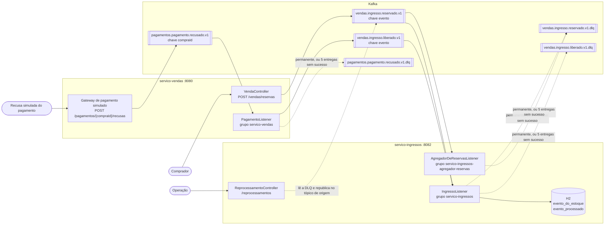

# Arquitetura do sistema de venda de ingressos

## 1. O domínio

O sistema trata da reserva de ingressos para shows organizados em setores de capacidade fixa. Cada setor mantém sua própria disponibilidade e constitui uma fronteira independente para a decisão de retirar ou devolver ingressos.

Na configuração atual, o evento `show-pucminas-2026` possui três setores:

| Setor | Capacidade |
|---|---:|
| PISTA | 100 |
| CAMAROTE | 20 |
| ARQUIBANCADA | 50 |

A reserva está sujeita a duas regras principais. Um CPF pode reservar no máximo quatro ingressos, e uma reserva só pode retirar ingressos de um setor quando existe disponibilidade suficiente. A capacidade de cada setor é registrada no próprio histórico do estoque e não como um saldo inicial inserido diretamente em uma tabela.

Reserva e pagamento são momentos distintos. Depois que uma reserva é aceita, os ingressos já não estão disponíveis para outro comprador, embora o pagamento ainda possa ser recusado. Existe, portanto, um estado intermediário legítimo no qual os ingressos estão reservados, mas a compra ainda não está paga.

O pagamento representa a interação com uma operadora externa. Neste sistema essa operadora é simulada pelo gateway que roda junto ao `servico-vendas`. Uma recusa é iniciada por `POST /pagamentos/{compraId}/recusas`, mas a consequência da recusa não é executada como uma chamada direta ao serviço de estoque. A recusa é publicada como fato e inicia uma Saga coreografada que termina com a devolução dos ingressos retirados pela reserva.

O estoque é mantido por setor e pode explicar seu estado atual por meio do histórico de fatos. Além da disponibilidade, o sistema mantém uma agregação das reservas por evento e setor em janelas de um minuto. Assim, é possível responder quantos ingressos restam em determinado setor, quais fatos levaram a esse estado e quantos ingressos foram reservados em cada janela da agregação.

O escopo termina antes das fases posteriores de uma operação comercial completa. O sistema não emite o ingresso ao comprador, não realiza cobrança financeira real, não executa reembolso e não controla a entrada no local do evento. O gateway existente representa apenas a fronteira necessária para simular a resposta externa de pagamento.

## 2. Os eventos

A comunicação entre os componentes usa fatos de domínio. Os nomes dos eventos descrevem acontecimentos que já ocorreram, em vez de ordens para que outro componente execute determinada ação. Por isso são expressos no particípio: um ingresso foi reservado ou liberado e um pagamento foi recusado.

Os contratos completos dos eventos publicados estão em [`docs/contrato.md`](contrato.md).

### 2.1 Eventos publicados

Três fatos participam do fluxo principal:

| Evento | Tipo/tópico | Significado |
|---|---|---|
| `IngressoReservadoEvent` | `vendas.ingresso.reservado.v1` | Uma reserva foi aceita pelo `servico-vendas`. |
| `PagamentoRecusadoEvent` | `pagamentos.pagamento.recusado.v1` | O gateway simulado recusou o pagamento de uma compra. |
| `IngressoLiberadoEvent` | `vendas.ingresso.liberado.v1` | O `servico-vendas` decidiu liberar os ingressos retirados pela reserva após a recusa do pagamento. |

`IngressoReservadoEvent` é um fato e não um pedido para baixar estoque. O `servico-ingressos` decide, ao consumi-lo e reconstruir o agregado do setor, se aquela reserva efetivamente consegue retirar ingressos.

`PagamentoRecusadoEvent` representa a resposta do sistema externo de pagamento. O fato é publicado pelo gateway simulado e consumido pelo próprio `servico-vendas`, em outro ponto do fluxo. Isso mantém separadas a ocorrência da recusa e a reação da venda à recusa.

`IngressoLiberadoEvent` representa a decisão de desfazer o efeito da reserva sobre o estoque. O nome substitui a antiga ideia de "reserva compensada": `liberado` descreve o fato de domínio observado pelos consumidores, enquanto "compensação" descrevia o mecanismo usado para chegar a esse resultado.

### 2.2 Eventos internos do estoque

O `servico-ingressos` mantém quatro tipos de fatos no event store:

| Evento | Significado |
|---|---|
| `SetorAbertoEvent` | Registra a capacidade inicial de um setor. |
| `IngressoRetiradoEvent` | Registra quantos ingressos uma reserva efetivamente retirou daquele setor. |
| `ReservaRecusadaEvent` | Registra que uma tentativa de reserva não pôde retirar ingressos. |
| `IngressoDevolvidoEvent` | Registra a devolução ao setor dos ingressos anteriormente retirados por uma reserva. |

Esses eventos pertencem ao histórico interno do estoque e não são publicados como parte do contrato entre os serviços. O estado de `EstoqueDoSetor` é reconstruído aplicando esses fatos na ordem do stream.

A devolução não apaga um `IngressoRetiradoEvent`. O histórico preserva tanto a retirada quanto a devolução posterior. Assim, o estado atual pode mudar sem apagar o fato de que a reserva existiu.

### 2.3 Identidade e correlação

Cada evento possui seu próprio `eventoId`. Essa identidade é usada para deduplicação e permite reconhecer uma nova entrega do mesmo fato.

Além da identidade do próprio evento, os fatos da Saga mantêm referências explícitas aos acontecimentos anteriores. `reservaEventoId` identifica o `IngressoReservadoEvent` cuja retirada precisa ser desfeita. `pagamentoEventoId` identifica o `PagamentoRecusadoEvent` que originou a liberação.

A relação pode ser lida como uma cadeia:

`IngressoReservadoEvent.eventoId`
→ `IngressoLiberadoEvent.reservaEventoId`

`PagamentoRecusadoEvent.eventoId`
→ `IngressoLiberadoEvent.pagamentoEventoId`

Essa correlação é especialmente importante no estoque. O `compraId` serve para correlacionar a operação comercial e os logs, mas o event store do estoque conhece a reserva pelo fato que produziu a retirada. Por isso a liberação identifica explicitamente `reservaEventoId`.

O estoque não devolve cegamente `itens[].quantidade` recebido na liberação. Ele localiza no próprio histórico quanto aquela reserva efetivamente retirou e devolve essa quantidade. A informação recebida no evento não substitui o log como fonte da verdade.

### 2.4 Envelope e evolução

Os eventos publicados seguem CloudEvents 1.0 em modo binário. Os atributos CloudEvents são transportados nos cabeçalhos da mensagem, enquanto o `data` é serializado como JSON. As datas são representadas em ISO-8601.

A compatibilidade adotada é BACKWARD. Uma versão nova do produtor deve continuar podendo ser consumida pelo consumidor existente dentro da evolução prevista pelo contrato. O contexto operacional permite implantação coordenada porque uma única equipe controla os dois lados da integração. Quando uma mudança exige atualização dos dois componentes, o consumidor é implantado primeiro e o produtor depois.

Mudanças incompatíveis de significado ou de campos obrigatórios não são escondidas dentro do mesmo contrato. A substituição de `vendas.ingresso.reserva-compensada.v1` por `vendas.ingresso.liberado.v1` é um exemplo: a mudança introduz uma nova semântica e novas referências necessárias para correlacionar corretamente os fatos.

## 3. O desenho

A solução é dividida em dois serviços de aplicação conectados pelos tópicos de eventos.

O `servico-vendas`, na porta 8080, recebe reservas, mantém em memória as informações necessárias às regras de venda e simula a integração com o gateway de pagamento. Ele continua sem banco próprio. Além de publicar reservas e liberações, passa a consumir as recusas de pagamento no grupo `servico-vendas`.

O `servico-ingressos`, na porta 8082, mantém o estoque usando event sourcing. Seu estado persistente fica em H2, incluindo o log `evento_do_estoque` e os registros usados para deduplicação. O mesmo processo também executa o agregador de reservas, porém em um grupo Kafka independente do consumidor responsável pelo estoque.

O fluxo principal é:



### 3.1 Tópicos

| Tópico | Chave | Quem publica | Quem consome, e o grupo | Retenção |
|---|---|---|---|---|
| `vendas.ingresso.reservado.v1` | `evento` | servico-vendas | servico-ingressos (`servico-ingressos`) e agregador (`servico-ingressos-agregador-reservas`) | 7 dias |
| `pagamentos.pagamento.recusado.v1` | `compraId` | gateway simulado, no servico-vendas | servico-vendas (`servico-vendas`) | 7 dias |
| `vendas.ingresso.liberado.v1` | `evento` | servico-vendas | servico-ingressos (`servico-ingressos`) | 7 dias |
| `vendas.ingresso.reservado.v1.dlq` | a original | servico-ingressos, pelos dois grupos | leitura sob demanda | 30 dias |
| `vendas.ingresso.liberado.v1.dlq` | a original | servico-ingressos | leitura sob demanda | 30 dias |
| `pagamentos.pagamento.recusado.v1.dlq` | a original | servico-vendas | leitura sob demanda | 30 dias |

Todos os tópicos possuem atualmente uma partição. Cada DLQ é declarada como `NewTopic` pelo serviço que escreve nela.

A chave `evento` é usada para reserva e liberação porque mantém os fatos de um mesmo evento de entretenimento na mesma partição. Isso preserva a ordem dentro dessa chave. A recusa de pagamento usa `compraId`, pois é a compra que identifica o fluxo tratado pelo `servico-vendas`.

### 3.2 Saga do pagamento recusado

A Saga é coreografada e acontece em três passos.

Primeiro, o `servico-vendas` publica `IngressoReservadoEvent`. O `servico-ingressos` consome esse fato e registra no log do estoque o resultado da tentativa de reserva.

Depois, quando `POST /pagamentos/{compraId}/recusas` é acionado, o gateway simulado publica `PagamentoRecusadoEvent`.

Por fim, o `servico-vendas` consome a recusa, localiza a reserva correspondente, devolve a cota do CPF e publica `IngressoLiberadoEvent`. O `servico-ingressos` consome a liberação, encontra pelo `reservaEventoId` o que aquela reserva realmente retirou e registra um `IngressoDevolvidoEvent`.

Não existe um coordenador central mantendo o estado completo da Saga. Cada participante reage ao fato que lhe interessa e publica o próximo fato quando sua decisão local é concluída.

### 3.3 Semântica de entrega

O processamento assume semântica de pelo menos uma vez. Uma mensagem pode ser entregue novamente quando o processamento anterior não terminou com confirmação do offset.

O reconhecimento ocorre depois da conclusão do processamento que precisa ser preservado. No `servico-ingressos`, isso significa que a confirmação não deve anteceder o commit da alteração persistente. Se houver falha antes desse ponto, a mensagem pode voltar a ser entregue.

Por isso a correção não depende de uma hipótese de entrega exatamente uma vez. Os consumidores são idempotentes e identificam eventos já processados. No estoque, a identidade do evento protege contra repetição da mesma mensagem e a identidade da reserva protege a operação de liberação contra um segundo efeito sobre a mesma retirada.

## 4. As decisões

As decisões arquiteturais que explicam o desenho atual estão registradas nos ADRs do repositório. A tabela resume a decisão central e uma consequência aceita de cada uma.

| ADR | Decisão | Consequência aceita |
|---|---|---|
| [ADR-002](adr/ADR-002-dominio-do-projeto.md) | domínio de venda de ingressos | reserva e pagamento são fatos separados, e o sistema convive com um estado intermediário, reservado e não pago |
| [ADR-003](adr/ADR-003-chave-de-particao.md) | chave de partição do tópico de reservas | uma pergunta por CPF em todos os eventos não se responde sem repartir, e um show com volume muito maior que os outros concentra uma partição |
| [ADR-004](adr/ADR-004-contrato-agregador-e-compensacao.md) | contrato, agregador por janela e compensação | sem watermark, uma janela da agregação já consultada pode mudar quando chega uma reserva atrasada |
| [ADR-005](adr/ADR-005-event-sourcing.md) | event sourcing no estoque | cada decisão relê o stream do setor, e o log só cresce, sem expurgo nem snapshot |
| [ADR-006](adr/ADR-006-resiliencia.md) | resiliência e Saga | uma falha transitória segura a partição por até 15 s, e com chave `evento` e 1 partição as vendas de todos os shows param juntas |
| [ADR-007](adr/ADR-007-projecoes-e-replay.md) | projeções e replay | a disponibilidade exibida pode estar até 1 s atrás do log |

O ADR-002 estabelece a razão para separar reserva, pagamento e compensação: existe uma interação externa entre a retirada inicial e a confirmação financeira, e essa interação pode falhar.

O ADR-003 justifica a chave `evento` do tópico de reservas: ela mantém em ordem, numa mesma partição, as reservas que disputam o mesmo estoque, sem exigir repartition topic para a agregação por `(evento, setor)`. Em troca, não responde perguntas por CPF atravessando eventos diferentes.

O ADR-004 estabelece o contrato dos eventos e a agregação temporal. A agregação usa o instante do próprio evento e não o instante em que a mensagem chegou ao consumidor, permitindo reconstrução determinística a partir do mesmo histórico.

O ADR-005 define `EstoqueDoSetor` como agregado e o log append-only como fonte da verdade. A capacidade, a retirada, a recusa e a devolução são fatos do stream. Uma devolução acrescenta um novo fato em vez de apagar ou alterar a retirada anterior.

O ADR-006 reúne as decisões de resiliência e a Saga do pagamento recusado. A Saga é coreografada, e a liberação referencia explicitamente a reserva que precisa ser desfeita. Falhas transitórias podem ser tentadas novamente e, quando o processamento não consegue prosseguir, existe um caminho separado de falha e reprocessamento.

O ADR-007 separa a fonte da verdade das estruturas destinadas à leitura. As projeções podem ser reconstruídas a partir do histórico e não participam da decisão de aceitar ou recusar uma retirada de estoque.

## 5. Quando falha

Uma mensagem que um consumidor não consegue processar tem dois destinos. Ou é entregue de novo depois de uma espera, ou sai do caminho e vai para uma fila de mensagens mortas, a DLQ, onde espera uma decisão de alguém. Em cada serviço, o tratador de erro configurado em `ResilienciaConfig` escolhe o destino pela exceção que subiu do consumidor. Nenhum listener tem `try/catch`: se tivesse, o offset andaria e o evento sumiria sem registro.

### 5.1 Transitória ou permanente

| Falha | Exemplos neste sistema | O que acontece |
|---|---|---|
| Permanente | JSON malformado, campo obrigatório ausente, quantidade menor ou igual a zero, `reservadoEm` ausente para o agregador, compra que o `servico-vendas` não conhece | vai direto para a DLQ, sem nova tentativa |
| Transitória | H2 fora do ar, conflito de versão no stream do estoque, liberação que chega antes da reserva, broker que não confirma a publicação da liberação | nova tentativa depois de 1, 2, 4 e 8 segundos; se a quinta entrega também falhar, vai para a DLQ |

A lista explícita é a das falhas permanentes. Tudo o que não está nela é tratado como transitório, porque tentar de novo com limite custa menos que perder um evento que passaria. A tabela completa das exceções está no [ADR-006](adr/ADR-006-resiliencia.md).

Enquanto uma mensagem espera a próxima tentativa, a partição fica parada atrás dela. Com uma partição por tópico, isso quer dizer até 15 segundos sem processar nenhuma outra reserva de nenhum show.

### 5.2 A DLQ

Cada tópico consumido tem a sua DLQ, com o mesmo nome acrescido de `.dlq`:

| DLQ | Quem escreve |
|---|---|
| `vendas.ingresso.reservado.v1.dlq` | `servico-ingressos`, pelo grupo do estoque e pelo do agregador |
| `vendas.ingresso.liberado.v1.dlq` | `servico-ingressos` |
| `pagamentos.pagamento.recusado.v1.dlq` | `servico-vendas` |

A mensagem chega à DLQ com o valor original e com os cabeçalhos `ce_*` intactos, inclusive o `ce_id`, que é o que permite reprocessar sem duplicar efeito. O Spring Kafka acrescenta tópico, partição, offset e grupo de origem nos cabeçalhos `kafka_dlt-*`. O serviço acrescenta o motivo em `dlq_excecao`, `dlq_mensagem`, `dlq_classificacao`, que vale `permanente` ou `transitoria-esgotada`, `dlq_falhou_em` e `dlq_servico`. O formato completo está em [`docs/contrato.md`](contrato.md), seção 16.

O offset da mensagem original só é confirmado depois que o broker confirma a gravação na DLQ. Entre o tópico e a DLQ, nenhuma mensagem se perde.

A DLQ guarda mensagens por 30 dias e não é lida por nenhum serviço. Quem a lê é a equipe, em rodízio semanal, todo dia útil pela manhã. Mensagem nas DLQs de liberação ou de pagamento é tratada no mesmo dia, porque representa um ingresso preso para um pagamento recusado. O número que importa é quantas mensagens entraram desde a última consulta.

### 5.3 Reprocessar

Reprocessar é uma operação manual em quatro passos, e ela só faz sentido depois que alguma coisa mudou:

1. Ler a DLQ e entender o motivo:
   ```powershell
   Invoke-RestMethod "http://localhost:8082/reprocessamentos/retidos?topicoDlq=vendas.ingresso.liberado.v1.dlq"
   ```
2. Corrigir a causa: código, dado ou contrato. Se nada mudou, a mensagem vai falhar de novo.
3. Republicar os eventos escolhidos, pelo `ce_id`:
   ```powershell
   Invoke-RestMethod -Method Post -Uri http://localhost:8082/reprocessamentos -ContentType 'application/json' -Body '{"topicoDlq":"vendas.ingresso.liberado.v1.dlq","ceIds":["<ce_id>"]}'
   ```
4. Confiar na idempotência. O estoque descarta o que já está em `evento_processado`, o agregador descarta o que já está em `evento_agregado`, e uma liberação só devolve ingressos uma vez por reserva.

O endpoint republica cada `ce_id` no tópico original, sem os cabeçalhos da DLQ e com `reprocessado_em` e `reprocessado_de`. Ele não tem opção "republicar tudo", e cada `ce_id` sai uma vez por chamada, mesmo quando a DLQ guarda uma cópia por grupo.

Republicar tem dois efeitos que precisam ser lembrados. O evento volta no fim do log, então a ordem original se perde: uma reserva reprocessada pode ser recusada por falta de um estoque que existia na hora em que ela foi feita. E o evento chega de novo a todos os grupos do tópico, inclusive aos que já o tinham processado, o que obriga todo consumidor desses tópicos a ser idempotente.

### 5.4 Quando a compensação falha

A liberação dos ingressos depois de um pagamento recusado passa por dois serviços, e cada passo pode falhar:

| Onde | Falha | O que acontece | Como fica sabendo | Como volta |
|---|---|---|---|---|
| `servico-vendas`, ao tratar a recusa | o broker não confirma a publicação da liberação | nova tentativa por até 15 segundos, depois `pagamentos.pagamento.recusado.v1.dlq`; a reserva continua na memória do serviço | DLQ com `transitoria-esgotada` | reprocessar a recusa pelo `ce_id` |
| `servico-vendas` | a compra não está na memória, porque o serviço reiniciou | DLQ direto | DLQ com `CompraNaoEncontradaException` | não volta sozinha: alguém confere `GET /estoque` e decide |
| `servico-ingressos`, ao tratar a liberação | a liberação chegou antes da reserva | nova tentativa por até 15 segundos, depois `vendas.ingresso.liberado.v1.dlq` | DLQ com `ReservaAindaNaoProcessadaException` | reprocessar depois que a reserva for processada |
| `servico-ingressos` | H2 fora do ar | igual à linha anterior | DLQ com a exceção de acesso ao banco | reprocessar quando o banco voltar |
| `servico-ingressos` | liberação repetida, por nova entrega ou por outro evento da mesma reserva | nada muda | log "nada a devolver" | não precisa |

Entre a recusa do pagamento e a devolução, o ingresso fica indisponível para venda. Na maior parte das vezes essa janela dura milissegundos. Com retentativa, dura até 15 segundos por passo. Com a mensagem na DLQ, dura até alguém reprocessar, e o prazo para isso é a consulta do dia útil seguinte. O sistema promete um de três finais: o efeito aconteceu inteiro, foi desfeito por um fato registrado no log, ou alguém foi avisado pela DLQ a tempo de agir.

## 6. Quando cresce

Hoje cada tópico tem uma partição. Um consumidor por grupo faz todo o trabalho, e uma segunda instância do `servico-ingressos` ficaria parada, sem partição para ler.

### 6.1 A ordem dos gargalos

1. O `servico-vendas` guarda a cota por CPF, as reservas aceitas e as compras liberadas em memória. Com duas instâncias atrás de um balanceador, o mesmo CPF compraria quatro ingressos em cada uma, e uma recusa de pagamento poderia chegar à instância que não conhece a compra. Esse serviço não escala na horizontal antes de levar o estado para um armazenamento compartilhado.
2. O `servico-ingressos` grava num H2 em arquivo, que prende o serviço a um processo. O event store já suporta gravações concorrentes, porque a versão do stream detecta a colisão e a retentativa relê o stream. O banco é que não suporta.
3. O número de partições é o teto de consumidores por grupo. Aumentar esse número depois remapeia as chaves para outras partições, então os tópicos precisam nascer com as partições que vão precisar antes de subir mais instâncias.

### 6.2 O que a chave permite e o que ela impede

Reserva e liberação usam a chave `evento`. Isso mantém em ordem as reservas de um mesmo show, que disputam o mesmo estoque. O custo é que um show inteiro cabe numa partição, e portanto numa thread. Numa abertura de vendas grande, todas as reservas daquele show caem na mesma partição, e subir mais instâncias não ajuda.

Espalhar a carga de um mesmo show exigiria uma chave mais fina, como evento mais setor. Só que uma reserva com PISTA e CAMAROTE é um evento só, que toca dois streams do estoque. A chave mais fina exigiria publicar um evento por setor, o que muda o contrato e faz o `servico-vendas` publicar vários eventos para uma compra.

A mesma chave impede perguntas por comprador. As reservas de um CPF em shows diferentes caem em partições diferentes, e nenhum consumidor particionado por `evento` as vê juntas. A regra de quatro ingressos por CPF é conferida hoje na memória do `servico-vendas`, na hora do pedido. Responder perguntas por CPF a partir dos eventos exigiria republicar as reservas num tópico com chave CPF, com um tópico e um consumidor a mais e o CPF gravado em mais um log.

Por isso o diagnóstico de atraso olha o lag por partição, e não o total. Um atraso distribuído pelas partições pede mais consumidores. Um atraso concentrado numa partição pede outra chave.

### 6.3 Autoescala

O gatilho para subir instâncias de um consumidor é o lag do grupo, e não o uso de CPU. Um consumidor esperando o banco pode estar com CPU baixa e fila enorme. Se a autoescala entrar, ela precisa de três limites: um limiar de lag por réplica, um máximo de réplicas nunca acima do número de partições, que hoje é um, e subida rápida com descida lenta, porque cada mudança de réplicas provoca um rebalanceamento do grupo. A autoescala não resolve partição quente: com a carga concentrada numa chave, mais réplicas só distribuem a mesma espera.

### 6.4 O que medir primeiro

O lag por partição do grupo `servico-ingressos`:

```powershell
docker exec aed-kafka /opt/kafka/bin/kafka-consumer-groups.sh --bootstrap-server kafka:9094 --describe --group servico-ingressos
```

## 7. O que se enxerga

Todas as linhas de log dos consumidores trazem o `ce_id` da mensagem, que é o mesmo `eventoId` do corpo, e a partição e o offset de onde ela veio. O `servico-vendas` registra o `compraId` e a `reservaEventoId` quando trata uma recusa de pagamento. A `reservaEventoId` liga os três fatos da Saga.

Com isso, a equipe consegue responder três perguntas no meio da madrugada:

1. **A compra X ficou com ingresso preso?** No log do `servico-vendas`, a linha `reserva liberada: compraId=X reservaEventoId=R` dá o identificador da reserva. `GET /estoque/{evento}/{setor}` mostra o histórico do setor: o `IngressoRetirado` com `origemEventoId` igual a R e, se a liberação chegou, o `IngressoDevolvido` com `reservaEventoId` igual a R. Se a devolução não está lá, `GET /reprocessamentos/retidos` nas DLQs de liberação e de pagamento diz onde ela parou e por quê.
2. **O `servico-ingressos` parou? Em qual partição?** O comando da seção 6.4 mostra, por partição, o offset confirmado e o lag. Um offset parado com lag crescendo, junto com linhas de retentativa repetindo o mesmo offset no log, indica uma mensagem sendo retentada. Um offset parado sem nenhum erro no log indica o consumidor preso numa chamada que não retorna.
3. **O que está caindo na DLQ agora, e por quê?** `GET /reprocessamentos/retidos?topicoDlq=...` lista cada mensagem retida com `dlq_excecao`, `dlq_mensagem`, `dlq_classificacao` e `dlq_falhou_em`. O Kafka UI, em `http://localhost:8081`, mostra quantas mensagens cada DLQ tem. Muitas mensagens `permanente` de uma vez quase sempre indicam um contrato quebrado ou uma implantação ruim.

O sistema ainda não mostra onde o tempo de um fluxo foi gasto, porque não há rastreamento distribuído nem cabeçalho `traceparent` atravessando o broker. Também não mostra a idade do evento mais antigo ainda não processado, não alarma quando a taxa de entrada na DLQ sobe e não mede o tempo entre o fato e o efeito. Esses itens estão na seção 8.

## 8. O que ficou de fora

| Item | Por que ficou de fora | Custo de fazer |
|---|---|---|
| Estado do `servico-vendas` em banco | o serviço nasceu sem banco, e o escopo coube em memória | um banco para o serviço, tabelas de reservas e de cotas por CPF; cerca de 2 dias |
| Outbox na publicação da reserva | a resposta 202 sai antes da confirmação do broker; se a publicação falhar, a cota do CPF foi consumida e o estoque nunca soube da reserva | tabela de outbox e um publicador agendado, depois do item anterior; cerca de 1 dia |
| Expiração de reserva | um caminho de exceção, o pagamento recusado, cobria a Saga | um temporizador por reserva no `servico-vendas`, um evento de expiração e o mesmo caminho de liberação; cerca de 1 dia |
| Retentativa sem parar a partição | as falhas transitórias conhecidas se resolvem em segundos | dois ou três tópicos de retentativa em degraus, aceitando perder a ordem por chave; cerca de 1 dia |
| Rastreamento distribuído | não há ferramenta de observabilidade no ambiente | agente Java do OpenTelemetry nos dois serviços, um Collector e um Jaeger no `docker-compose.yml`, `trace_id` no padrão de log; cerca de 1 dia |
| Métricas e alarmes | idem | Micrometer, Prometheus, um exportador de lag e Grafana para lag por partição, idade do evento mais antigo, taxa de entrada na DLQ e tempo do fato ao efeito; cerca de 2 dias |
| Autenticação nos endpoints | o ambiente é local | Spring Security com um papel de operação, principalmente para `/reprocessamentos`; cerca de meio dia |
| Timeout e circuit breaker | nenhum listener chama serviço externo hoje | se um passar a chamar, timeout na chamada e pausa do container com o circuito aberto, em vez de descartar a mensagem; cerca de 1 dia |
| Banco servidor no `servico-ingressos` | H2 em arquivo basta para um processo | PostgreSQL no `docker-compose.yml` e ajuste do schema e da detecção de colisão; cerca de 1 dia |
| Snapshot do agregado | os streams de um setor são curtos | uma tabela de snapshot por stream, gravada a cada N eventos; cerca de 1 dia |
| Registro de schema | o contrato é um documento, e a mesma equipe controla os dois lados | um registry no `docker-compose.yml` e serializadores com schema; cerca de 1 dia |
| Mais partições | um consumidor por grupo dá conta do volume atual | declarar os tópicos com N partições antes de haver dados; algumas horas |

O dado pessoal merece um registro à parte. O `cpfComprador` viaja no evento de reserva, fica 7 dias no tópico e 30 dias na DLQ de reservas, e um log só de acréscimo não apaga uma linha. O `servico-ingressos` não guarda o CPF, porque o consumidor não declara o campo, mas o broker guarda. Resolver isso custaria publicar um token do CPF em vez do número, com a tabela de tokens no `servico-vendas`, ou cifrar o campo com uma chave por titular e descartar a chave quando o dado precisar ser apagado. São cerca de 2 dias de trabalho, mais uma revisão do tratamento de dados pessoais.